| **<br/>Лабораторная работа №4 по курсу "Greenplum для разработчиков и архитекторов баз данных"<br/>"Транзакции и настройка параметров хранения в Greenplum"<br/>**|
|---|

<br/>

## Задание:
### написать несколько транзакционных запросов с разными уровнями изоляции и проанализировать поведение системы при конкурентных операциях
### настроить параметры хранения для нескольких таблиц
### настроить и протестировать внешние таблицы для загрузки данных


<br/>

## Решение:

* Подключился к кластеру ArenaData
* Создал таблицу HEAP
```
create table test (id int, summ int) distributed by (id);
```
* Вставил 4 строки
```
insert into test values (1, 100);
insert into test values (2, 200);
insert into test values (3, 300);
insert into test values (4, 400);
```
* Открыл второй терминал и запустил там psql
* В первом терминале проверил текущий уровень изоляции транзакций, он установлен Read Committed
```
show transaction_isolation ;
```  
* Проверяем как работает уровень изоляции транзакций Read Uncommitted (проверяем номинально, т.к. Read Uncommitted работает так же как и Read Committed):
** В первом терминале открываем транзакцию и вставляем новую строчку в таблицу, транзакцию не фиксируем. Затем проверяем количество записей в таблице, их будет 5, т.к. транзакция видит данные, которые не зафиксированы, но вставлены самой транзакцией
```
Begin;
SET TRANSACTION ISOLATION LEVEL Read Uncommitted;
insert into test values (5, 500);
select count(*) from test;
```

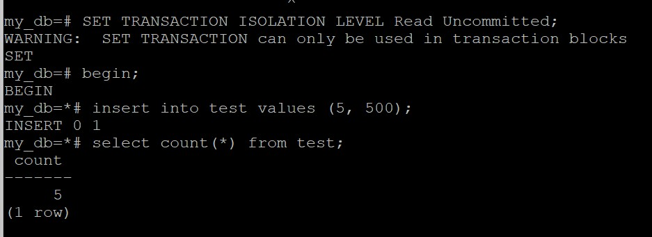

** Во втором терминале выставляем уровень изоляции транзакций как Read Uncommitted и пытаемся прочитать данные из таблицы. Ожидаемо получаем 4 строки, т.к. грязное чтение не поддерживается
```
Begin;
SET TRANSACTION ISOLATION LEVEL Read Uncommitted;
select count(*) from test;
```

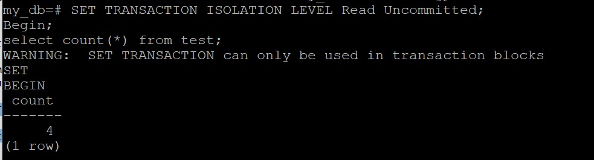

** Выполняем rollback
* Выполняем все аналогично, но с уровнем изоляции транзакций Read Committed
** В первом терминале открываем транзакцию и вставляем новую строчку в таблицу, транзакцию не фиксируем. Затем проверяем количество записей в таблице, их будет 5, т.к. транзакция видит данные, которые не зафиксированы, но вставлены самой транзакцией
```
Begin;
SET TRANSACTION ISOLATION LEVEL Read Committed;
insert into test values (5, 500);
select count(*) from test;
```

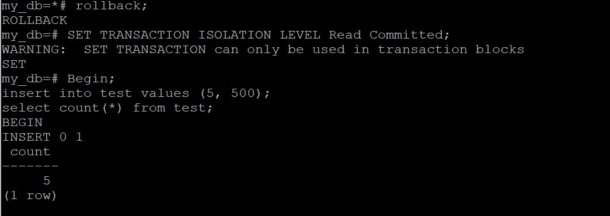

** Во втором терминале выставляем уровень изоляции транзакций как Read Uncommitted и пытаемся прочитать данные из таблицы. Ожидаемо получаем 4 строки, т.к. грязное чтение не поддерживается
```
Begin;
SET TRANSACTION ISOLATION LEVEL Read Committed;
select count(*) from test;
```

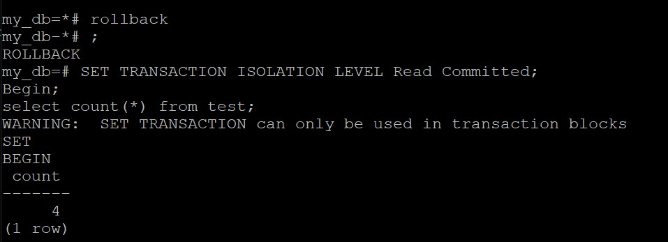

** Выполняем rollback
* Как видно из работы, уровни изоляции транзакций Read Committed и Read Uncommitted ведут себя идентично
* Проверяем уровень изоляции транзакций Repeatable Read 
** В первом терминале открываем транзакцию с уровнем изоляции Repeatable Read, читаем таблицу test, получаем 4 строки
```
begin;
SET TRANSACTION ISOLATION LEVEL Repeatable Read;
select * from test;
```
** Во втором терминале добавляем строку в таблицу test. Т.к. транзакция тут не открывалась, то данные будут в таблицы.
```
insert into test values (5, 500);
```
** В первом терминале снова выбираем данные из таблицы тест. Но получаем все так же 4 строки. Т.к. снимок таблицы был сделан на 
момент первой операции в транзакции (select) и в тот момент в таблице было 4 записи, то мы их и получаем. Не смотря на то, что в таблице уже есть новые зафиксированные записи. Откатываем транзакцию, делаем выборку из таблицы и получаем 5 записей.

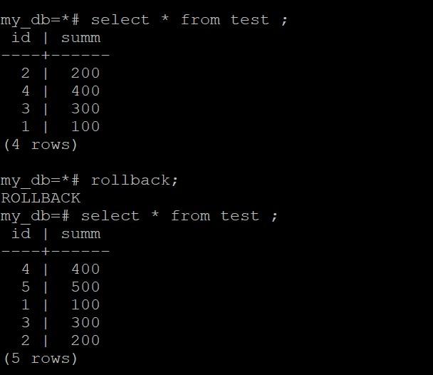

* Тестируем уровень Serializable
** В первом терминале открываем транзакцию с уровнем изоляции Serializable и пытаемся обновить строку с идентификатором 1
```
begin;
SET TRANSACTION ISOLATION LEVEL Serializable;
update test set summ = 600 where id = 1;
```
** Во втором терминале открываем транзакцию с уровнем Serializable и пытаемся обновить так же строку с идентификатором 1. Операция попадает на блокировку строки
```
begin;
SET TRANSACTION ISOLATION LEVEL Serializable;
update test set summ = 700 where id = 1;
```
** В первом терминале фиксируем транзакцию, а во втором получаем ошибку обновления, связанную с выбранным уровнем изоляции транзакций.

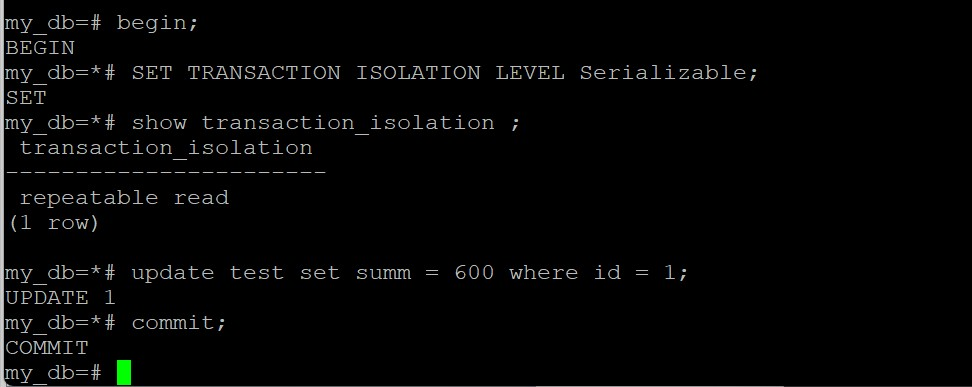

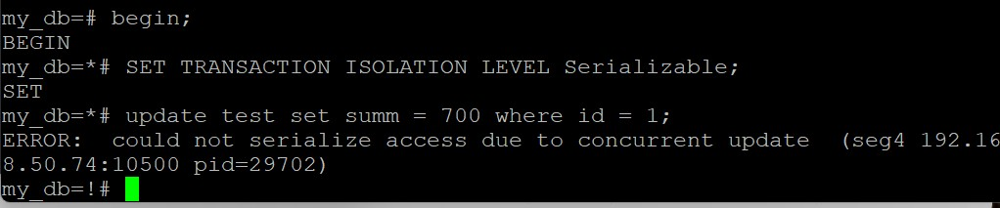

* Создал три таблицы
```
create table test1 (id int) 
WITH (appendoptimized=true, orientation=column, compresstype=ZSTD, compresslevel=5)
distributed by (id);

create table test2 (id int) 
WITH (appendoptimized=true, orientation=column, compresstype=ZSTD, compresslevel=1)
distributed by (id);

create table test3 (id int) 
WITH (appendoptimized=true, orientation=row, compresstype=ZSTD, compresslevel=5)
distributed by (id);
```
* Вставил в них данные
```
insert into test1 select * from generate_series(0,1000000);
insert into test2 select * from generate_series(0,1000000);
insert into test3 select * from generate_series(0,1000000);
```
* Посмотрел объем таблиц
```
SELECT pg_size_pretty(pg_total_relation_size('test1')), pg_size_pretty(pg_total_relation_size('test2')),
pg_size_pretty(pg_total_relation_size('test3'));
```

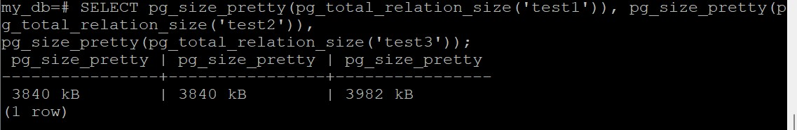

* Получилось что на текущих тестовых данных уровень сжатия не играет роли. Но строчная ориентация заняла чуть больше места на диске.
* Создал внешнюю таблицу для записи и вставил в нее данные
```
CREATE WRITABLE EXTERNAL TABLE my_ext_wr
    (id int)
     LOCATION('gpfdist://192.168.50.70:8080/out_wr')
     FORMAT 'CSV' DISTRIBUTED BY (id );
insert into my_ext_wr generate_series(0,1000000); 
```

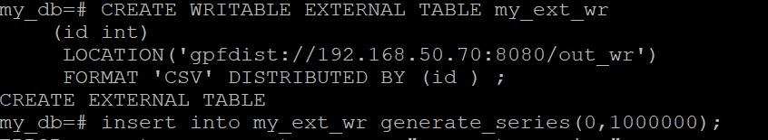

* Прочитал первые 10 строк файла в операционной системе, данные на месте. Скопировал файл и подключил копию как внешную таблицу для чтения
```
CREATE EXTERNAL TABLE my_ext_r
    (id int)
     LOCATION('gpfdist://192.168.50.70:8080/in')
     FORMAT 'CSV' ;
```

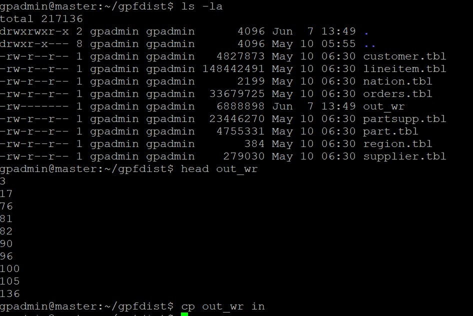

* Выполнил select данные есть

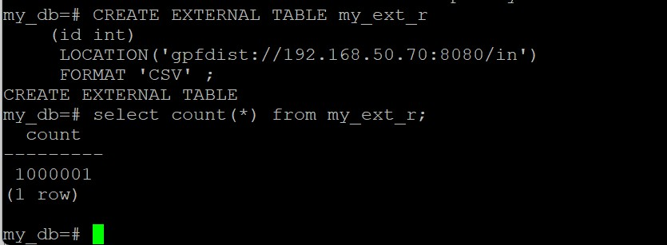
